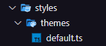

# Aprofundando em Hooks

## Estrutura da Aplicação e Styled Components

  O Styled Components é uma biblioteca de CSS-in-JS que permite que a gente utilize o CSS dentro do JavaScript e em um formato parecido com os do React, adicionando muitas funcionalidades à estilização da nossa aplicação.

  Para instalar o Styled-components, basta utilizar o gerenciador de projeto no seu terminar e instalar:

```terminal
npm i styled-components

yarn add styled-components
```

  Além do pacote do styled-components devemos instalar a versão para typescript para ambiente de desenvolvimento:

```terminal
npm i @types/styled-components

yarn add @types/styled-components
```
  
  A exemplo das funcionalidades podemos usar diferentes temas de estilização com o styled components. Na nossa aplicação criamos uma pasta de estilos e dentro dela uma pasta somente para os temas do projeto.

  

  Dentro dele teremos um esquema de exportação da variável que possui as cores do tema padrão da aplicação.

```typescript
// default.ts
export const defaultThemes = {
  white: '#FFF',

  'gray-100': '#E1E1E6',
  'gray-300': '#C4C4CC',
  'gray-400': '#8D8D99',
  'gray-500': '#7C7C8A',
  'gray-600': '#323238',
  'gray-700': '#29292E',
  'gray-800': '#202024',
  'gray-900': '#121214',

  'green-300': '#00B37E',
  'green-500': '#00875F',
  'green-700': '#015F43',

  'red-500': '#AB222E',
  'red-700': '#7A1921',

  'yellow-500': '#FBA94C',
}
```

  Para usar o tema temos nosso exemplo de botão na aplicação. Como a maioria dos elementos no React, temos um documento typescript para usar o styled-components, dessa forma, temos o arquivo `Button.styles.ts` como um arquivo de estilização em _typescript_.

  ```typescript
  // Button.styles.ts

  import styled from "styled-components";
  
  export const ButtonContainer = styled.button<ButtonProps>`
    height: 40px;
    width: 100px;
  `;
  ```

  Uma das muitas vantagens que temos ao usar o styled components é que ao tratarmos este arquivo como um componente, podemos receber propriedades do componente pai para estilização também. Assim, podemos desfrutar de diferentes temas para o mesmo componente sem precisar de várias estruturas css.

  ```typescript
  // Button.styles.ts

  import styled from "styled-components";
  
  export type ButtonVariant = "primary" | "secondary" | 'danger' | 'success';

  interface ButtonProps {
    variant?: ButtonVariant;
  }

  const buttonVariants = {
    primary: 'purple',
    secondary: 'blue',
    danger: 'red',
    success: 'green'
  }

  export const ButtonContainer = styled.button<ButtonProps>`
    height: 40px;
    width: 100px;

    ${(props) => {
    return `
      background-color: ${buttonVariants[props.variant || 'primary']}
    `
    }}
  `;
  ```

  No exemplo acima o componente de estilização recebe uma propriedade e a partir dele mostra a estilização específica dada como parâmetro para o botão.

## Estilos Globais

  É comum em aplicações web termos configurações de estilos globais. O Styled Components também nos ajuda com isso, por meio de uma função chamada `createGlobalStyle`.

  Dentro da pasta de estilos já temos o caminho para os temas com todas as cores que usaremos e além dela criamos o arquivo `global.ts` onde implementamos todas as estilizações padrões da nossa aplicação usando a função citada anteriormente.

```typescript
// global.ts
import { createGlobalStyle } from 'styled-components'

export const GlobalStyles = createGlobalStyle`
  * {
    margin: 0;
    padding: 0;
    box-sizing: border-box;
  }

  body {
    background: ${props => props.theme['gray-900']};
    color: ${props => props.theme['gray-300']};
  }

  body, input, textarea, button {
    font-family: 'Roboto', sans-serif;
    font-weight: 400;
    font-size: 1rem;
  }
`;
```

  E como foi citado antes, as variáveis de cores são acessadas por funções dentro de expressões embutidas `${}`.

  Para usarmos os estilos globais dentro do projeto, importamos as configurações e as variáveis de estilo dentro do arquivo `App.tsx` para usarmos em toda a aplicação.

```typescript
// App.tsx
import { ThemeProvider } from 'styled-components'
import { Button } from "./components/Button"
import { defaultThemes } from './styles/themes/default'
import { GlobalStyles } from './styles/global'

export function App() {

  return (
    <ThemeProvider theme={defaultThemes}>
      <GlobalStyles/>
      
      <Button variant="primary"/>
      <Button variant="danger" />
    </ThemeProvider>
  )
}
```

  Dentro do styled-components a função `ThemeProvider` fornece um componente para manipulação de temas para o projeto. Usamos ele ao redor dos componentes com a propriedade `theme=` que permite adicionar o arquivo de temas para ser acessado.

  Anteriormente tinhamos o fragment `<></>` por volta dos componentes, mas para que todo o projeto consiga utilizar os temas devemos colocar o componente `<ThemeProvider>` fornecido pelo _styled-components_.

  Já o `<GlobalStyles/>` pode ser usado dentro da aplicação em qualquer lugar, com isso as estilizações serão configuradas no projeto.

## Tipagem de Temas

  Algumas configurações do Styled Components não permite que acessemos todas ass variáveis quando exportadas, para isso criamos um arquivo de definição de tipos que tem como sufixo `.d.ts` presente na pasta **/@types**.

  No arquivo `styled.d.ts` temos uma configuração padrão para definir os tipos das variáveis exportadas nos temas do styled-components do nosso projeto. Geralmente usamos isso para o styled-components e não é necessário memorizar a utilização desse arquivo, podemos usá-lo na maioria dos nossos projetos da mesma forma como está neste.

```typescript
import 'styled-components'
import { defaultThemes } from '../styles/themes/default'

type ThemeType = typeof defaultThemes;

declare module 'styled-components' {
  export interface DefaultTheme extends ThemeType {}
}
```

  Essa coniguração permite acessar as variáveis mais facilmente em qualquer lugar do projeto.

## React Router dom

  Nessa parte do projeto, iniciaremos a utilização e aprendizado nas rotas de uma aplicação. Basicamente a capacidade de mudar de página em um site na web.

  Para isso vamos utilizar a biblioteca mais famosa em construir rotas no react que é a React Router Dom. Mais informações de como utilizar pode-se acessar o links da [documentação](https://reactrouter.com/en/main)  e da introdução a ele na [w3 School](https://www.w3schools.com/react/react_router.asp).

```terminal
npm i react-router-dom

yarn add react-router-dom
```

  Depois da instalação, recomenda-se criar uma pasta dentro do `/src` chamada __/pages__ `/src/pages`. Dentro dela criaremos os caminhos pelos quais a nossa aplicação percorrerá durante sua execução.

  No nosso projeto criamos os componentes `Home.tsx` e `History.tsx`. Essa fase não é necessária, poderiam ser criados dentro do próprio App.tsx, mas por questão de melhor organização do projeto, optamos por deixar dessa forma.

  

  Agora para podermos acessá-los devemos configurar as "Routes" dentro do nosso App.tsx que é a raiz da nossa aplicação. Para isso temos duas opções, podemos criar e importar nossas ferramentas do react-router diretamente no componente `App.tsx` ou criar um componente a parte com a configuração e importações necessárias para acoplarmos ao `App.tsx` em seguida.

  Por razões de organização, vamos para a última opção citada criando o arquivo Router.tsx que conterá a configuração dos caminhos da aplicação.

```js
// Router.tsx
import { Routes, Route } from 'react-router-dom';

import { Home } from './pages/Home';
import { History } from './pages/History';
 
export function Router() {

  return (
    <Routes>
      <Route path='/' element={ <Home/> } />
      <Route path='/history' element={ <History/> } />
    </Routes>
  );
}
```

  O **Routes** é uma ferramenta utilizada para guardar o conjunto de componentes **Route** onde cada um deles possuirá um caminho da aplicação.

  Cada `<Route>` possui as propriedades `path=` que indica o caminho da url para aquela rota e `element=` que indica qual componente será mostrado naquela rota.

  A execução dessas rotas será feita dentro do `App.tsx` com o componente **Router** importado do aquivo criado e com o componente `BrowserRouter` importado da biblioteca react-router-dom.

```js
// App.tsx
import { ThemeProvider } from 'styled-components';
import { BrowserRouter } from 'react-router-dom';
import { defaultThemes } from './styles/themes/default';
import { GlobalStyles } from './styles/global';
import { Router } from './Router';

export function App() {

  return (
    <ThemeProvider theme={defaultThemes}>
      <BrowserRouter>
        <Router />
      </BrowserRouter>
      <GlobalStyles/>
    </ThemeProvider>
  )
}
```

  Os componentes citados não são mostrados em tela pois eles são _**Context Providers**_ então eles não estão em volta de todos os outros compontes para mostrar algo em tela mas sim para dar a eles informações sobre o contexto em que eles estão inseridos.

  O BrowserRouter armazena a localização atual na barra de endereço do navegador usando URLs limpos e navega usando a pilha de histórico integrada do navegador.

## Layouts de Rotas

  O assunto nessa parte é opcional pois não é necessário ter essa mesma organização de pastas. Entretanto, a criação do Layout é uma ajuda para evitar colocar o mesmo componente em vários outros componentes de página.

  A biblioteca React Router Dom possui funcionalidades que permitem usar um ou mais layouts em uma ou mais páginas. Geralmente utilizamos essa ferramenta evitando repetições desnecessárias de componentes no nosso caso o `Header.tsx`.

```js
// /layouts/DefaultLayout.tsx

import { Outlet } from "react-router-dom";
import { Header } from "../components/Header";

export function DefaultLayout() {
  return (
    <div>
      <Header />
      <Outlet />
    </div>
  );
}
```

  O componente em questão `DefaultLayout.tsx` é um Layout usado na nossa aplicação. O `<Outlet/>` é um elemento do React Router que mostra onde as páginas dos caminhos devem ser integrados. Dessa forma, o `<Header/>` vai ser mostrado em todas as páginas da aplicação.

  Dentro do `Router.tsx` colocamos mais um elemento `<Route>` ao redor dos outros elementos `<Route>` de cada página para configurar quais conjuntos de páginas possuirão o layout destacado.

```js
// Router.tsx
// ...
return (
  <Routes>
    <Route path='/' element={ <DefaultLayout/> }  >
      <Route path='/' element={ <Home/> } />
      <Route path='/history' element={ <History/> } />
    </Route>
  </Routes>
);
```

