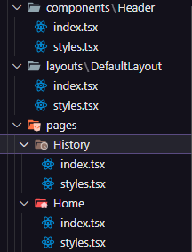

# Aprofundando em Hooks

## Estrutura da Aplicação e Styled Components

  O Styled Components é uma biblioteca de CSS-in-JS que permite que a gente utilize o CSS dentro do JavaScript e em um formato parecido com os do React, adicionando muitas funcionalidades à estilização da nossa aplicação.

  Para instalar o Styled-components, basta utilizar o gerenciador de projeto no seu terminar e instalar:

```terminal
npm i styled-components

yarn add styled-components
```

  Além do pacote do styled-components devemos instalar a versão para typescript para ambiente de desenvolvimento:

```terminal
npm i @types/styled-components

yarn add @types/styled-components
```
  
  A exemplo das funcionalidades podemos usar diferentes temas de estilização com o styled components. Na nossa aplicação criamos uma pasta de estilos e dentro dela uma pasta somente para os temas do projeto.

  

  Dentro dele teremos um esquema de exportação da variável que possui as cores do tema padrão da aplicação.

```typescript
// default.ts
export const defaultThemes = {
  white: '#FFF',

  'gray-100': '#E1E1E6',
  'gray-300': '#C4C4CC',
  'gray-400': '#8D8D99',
  'gray-500': '#7C7C8A',
  'gray-600': '#323238',
  'gray-700': '#29292E',
  'gray-800': '#202024',
  'gray-900': '#121214',

  'green-300': '#00B37E',
  'green-500': '#00875F',
  'green-700': '#015F43',

  'red-500': '#AB222E',
  'red-700': '#7A1921',

  'yellow-500': '#FBA94C',
}
```

  Para usar o tema temos nosso exemplo de botão na aplicação. Como a maioria dos elementos no React, temos um documento typescript para usar o styled-components, dessa forma, temos o arquivo `Button.styles.ts` como um arquivo de estilização em _typescript_.

  ```typescript
  // Button.styles.ts

  import styled from "styled-components";
  
  export const ButtonContainer = styled.button<ButtonProps>`
    height: 40px;
    width: 100px;
  `;
  ```

  Uma das muitas vantagens que temos ao usar o styled components é que ao tratarmos este arquivo como um componente, podemos receber propriedades do componente pai para estilização também. Assim, podemos desfrutar de diferentes temas para o mesmo componente sem precisar de várias estruturas css.

  ```typescript
  // Button.styles.ts

  import styled from "styled-components";
  
  export type ButtonVariant = "primary" | "secondary" | 'danger' | 'success';

  interface ButtonProps {
    variant?: ButtonVariant;
  }

  const buttonVariants = {
    primary: 'purple',
    secondary: 'blue',
    danger: 'red',
    success: 'green'
  }

  export const ButtonContainer = styled.button<ButtonProps>`
    height: 40px;
    width: 100px;

    ${(props) => {
    return `
      background-color: ${buttonVariants[props.variant || 'primary']}
    `
    }}
  `;
  ```

  No exemplo acima o componente de estilização recebe uma propriedade e a partir dele mostra a estilização específica dada como parâmetro para o botão.

## Estilos Globais

  É comum em aplicações web termos configurações de estilos globais. O Styled Components também nos ajuda com isso, por meio de uma função chamada `createGlobalStyle`.

  Dentro da pasta de estilos já temos o caminho para os temas com todas as cores que usaremos e além dela criamos o arquivo `global.ts` onde implementamos todas as estilizações padrões da nossa aplicação usando a função citada anteriormente.

```typescript
// global.ts
import { createGlobalStyle } from 'styled-components'

export const GlobalStyles = createGlobalStyle`
  * {
    margin: 0;
    padding: 0;
    box-sizing: border-box;
  }

  body {
    background: ${props => props.theme['gray-900']};
    color: ${props => props.theme['gray-300']};
  }

  body, input, textarea, button {
    font-family: 'Roboto', sans-serif;
    font-weight: 400;
    font-size: 1rem;
  }
`;
```

  E como foi citado antes, as variáveis de cores são acessadas por funções dentro de expressões embutidas `${}`.

  Para usarmos os estilos globais dentro do projeto, importamos as configurações e as variáveis de estilo dentro do arquivo `App.tsx` para usarmos em toda a aplicação.

```typescript
// App.tsx
import { ThemeProvider } from 'styled-components'
import { Button } from "./components/Button"
import { defaultThemes } from './styles/themes/default'
import { GlobalStyles } from './styles/global'

export function App() {

  return (
    <ThemeProvider theme={defaultThemes}>
      <GlobalStyles/>
      
      <Button variant="primary"/>
      <Button variant="danger" />
    </ThemeProvider>
  )
}
```

  Dentro do styled-components a função `ThemeProvider` fornece um componente para manipulação de temas para o projeto. Usamos ele ao redor dos componentes com a propriedade `theme=` que permite adicionar o arquivo de temas para ser acessado.

  Anteriormente tinhamos o fragment `<></>` por volta dos componentes, mas para que todo o projeto consiga utilizar os temas devemos colocar o componente `<ThemeProvider>` fornecido pelo _styled-components_.

  Já o `<GlobalStyles/>` pode ser usado dentro da aplicação em qualquer lugar, com isso as estilizações serão configuradas no projeto.

## Tipagem de Temas

  Algumas configurações do Styled Components não permite que acessemos todas ass variáveis quando exportadas, para isso criamos um arquivo de definição de tipos que tem como sufixo `.d.ts` presente na pasta **/@types**.

  No arquivo `styled.d.ts` temos uma configuração padrão para definir os tipos das variáveis exportadas nos temas do styled-components do nosso projeto. Geralmente usamos isso para o styled-components e não é necessário memorizar a utilização desse arquivo, podemos usá-lo na maioria dos nossos projetos da mesma forma como está neste.

```typescript
import 'styled-components'
import { defaultThemes } from '../styles/themes/default'

type ThemeType = typeof defaultThemes;

declare module 'styled-components' {
  export interface DefaultTheme extends ThemeType {}
}
```

  Essa coniguração permite acessar as variáveis mais facilmente em qualquer lugar do projeto.
# Páginas e Rotas
## React Router dom

  Nessa parte do projeto, iniciaremos a utilização e aprendizado nas rotas de uma aplicação. Basicamente a capacidade de mudar de página em um site na web.

  Para isso vamos utilizar a biblioteca mais famosa em construir rotas no react que é a React Router Dom. Mais informações de como utilizar pode-se acessar o links da [documentação](https://reactrouter.com/en/main)  e da introdução a ele na [w3 School](https://www.w3schools.com/react/react_router.asp).

```terminal
npm i react-router-dom

yarn add react-router-dom
```

  Depois da instalação, recomenda-se criar uma pasta dentro do `/src` chamada __/pages__ `/src/pages`. Dentro dela criaremos os caminhos pelos quais a nossa aplicação percorrerá durante sua execução.

  No nosso projeto criamos os componentes `Home.tsx` e `History.tsx`. Essa fase não é necessária, poderiam ser criados dentro do próprio App.tsx, mas por questão de melhor organização do projeto, optamos por deixar dessa forma.

  

  Agora para podermos acessá-los devemos configurar as "Routes" dentro do nosso App.tsx que é a raiz da nossa aplicação. Para isso temos duas opções, podemos criar e importar nossas ferramentas do react-router diretamente no componente `App.tsx` ou criar um componente a parte com a configuração e importações necessárias para acoplarmos ao `App.tsx` em seguida.

  Por razões de organização, vamos para a última opção citada criando o arquivo Router.tsx que conterá a configuração dos caminhos da aplicação.

```js
// Router.tsx
import { Routes, Route } from 'react-router-dom';

import { Home } from './pages/Home';
import { History } from './pages/History';
 
export function Router() {

  return (
    <Routes>
      <Route path='/' element={ <Home/> } />
      <Route path='/history' element={ <History/> } />
    </Routes>
  );
}
```

  O **Routes** é uma ferramenta utilizada para guardar o conjunto de componentes **Route** onde cada um deles possuirá um caminho da aplicação.

  Cada `<Route>` possui as propriedades `path=` que indica o caminho da url para aquela rota e `element=` que indica qual componente será mostrado naquela rota.

  A execução dessas rotas será feita dentro do `App.tsx` com o componente **Router** importado do aquivo criado e com o componente `BrowserRouter` importado da biblioteca react-router-dom.

```js
// App.tsx
import { ThemeProvider } from 'styled-components';
import { BrowserRouter } from 'react-router-dom';
import { defaultThemes } from './styles/themes/default';
import { GlobalStyles } from './styles/global';
import { Router } from './Router';

export function App() {

  return (
    <ThemeProvider theme={defaultThemes}>
      <BrowserRouter>
        <Router />
      </BrowserRouter>
      <GlobalStyles/>
    </ThemeProvider>
  )
}
```

  Os componentes citados não são mostrados em tela pois eles são _**Context Providers**_ então eles não estão em volta de todos os outros compontes para mostrar algo em tela mas sim para dar a eles informações sobre o contexto em que eles estão inseridos.

  O BrowserRouter armazena a localização atual na barra de endereço do navegador usando URLs limpos e navega usando a pilha de histórico integrada do navegador.

## Layouts de Rotas

  O assunto nessa parte é opcional pois não é necessário ter essa mesma organização de pastas. Entretanto, a criação do Layout é uma ajuda para evitar colocar o mesmo componente em vários outros componentes de página.

  A biblioteca React Router Dom possui funcionalidades que permitem usar um ou mais layouts em uma ou mais páginas. Geralmente utilizamos essa ferramenta evitando repetições desnecessárias de componentes no nosso caso o `Header.tsx`.

```js
// /layouts/DefaultLayout.tsx

import { Outlet } from "react-router-dom";
import { Header } from "../components/Header";

export function DefaultLayout() {
  return (
    <div>
      <Header />
      <Outlet />
    </div>
  );
}
```

  O componente em questão `DefaultLayout.tsx` é um Layout usado na nossa aplicação. O `<Outlet/>` é um elemento do React Router que mostra onde as páginas dos caminhos devem ser integrados. Dessa forma, o `<Header/>` vai ser mostrado em todas as páginas da aplicação.

  Dentro do `Router.tsx` colocamos mais um elemento `<Route>` ao redor dos outros elementos `<Route>` de cada página para configurar quais conjuntos de páginas possuirão o layout destacado.

```js
// Router.tsx
// ...
return (
  <Routes>
    <Route path='/' element={ <DefaultLayout/> }  >
      <Route path='/' element={ <Home/> } />
      <Route path='/history' element={ <History/> } />
    </Route>
  </Routes>
);
```

## Header & Layout

  A partir daqui, vamos organizar os componentes criados em pastas com seus nomes. Cada um dos componentes estará presente dentro de uma pasta com o nome do componente, dentro dessa pasta temos um arquivo `index.tsx` e outro `styles.tsx`.

  

  A organização dessa forma auxilia na implementação de novas features em cada componente. Cada um deles pode ter vários outros arquivos de configuração, não somente de estilo.

  ### Layout
  Na estilização do nosso __DefaultLayout__ criamos um style componente `<DefaultLayoutContainer/>` e a peculiaridade da sua estilização é o uso do `calc()` no valor da propriedade _height_.

```css
/*
  DefaultLayout/styles.tsx
*/
height: calc(100vh - 7rem);
```

  O uso do __height__ com `calc()` é útil para usar todo o espaço em tela sem precisar de uma scrollbar.

  ### Header
  Na criação do Header, segundo o design, colocamos uma logo de um lado da aplicação e um menu de navegação do outro lado. Para estilizarmos todas as tags e elementos, criamos um styled-component chamado `<HeaderContainer/>`.

```js
// Header/index.tsx
import { HeaderContainer } from "./styles";
import { Scroll, Timer } from 'phosphor-react'
import Logo from '../../assets/Logo.svg'

export function Header(){
  return (
    
  <HeaderContainer>
    
    <nav>
      <a href="/" title="Timer">
        <Timer size={24} />
      </a>
      <a href="/history" title="histórico">
        <Scroll size={24} />
      </a>
    </nav>
  </HeaderContainer>
  );
}
```
  A imagem da Logo foi exportaa do figma como ___*.svg*___ e os ícones dentro das âncoras vieram da biblioteca [Phosphor React](https://phosphoricons.com). As âncoras possuem proprieades _title_ por acessibiliade, geralmente em links que possuem apenas imagens é útil colocarmos um título para o usuário saber o que ou para onde o link o levará.

  A biblioteca react-douter-dom possui um componente muito útil que usamos na nossa aplicação e que pode ser usado em âncoras de navegação como essas dentro do `Header` é o componente `NavLink`.

```js
import { NavLink } from "react-router-dom";
 
export function Header() {
  return (
    <HeaderContainer>
      
      <nav>
        <NavLink to="/" title="Timer">
          <Timer size={24} />
        </NavLink>
        <NavLink to="/history" title="histórico">
          <Scroll size={24} />
        </NavLink>
      </nav>
    </HeaderContainer>
  );
}
```

  Esse componente funciona como uma tag `<a>` só que dentro do processo de rotas do react-router-dom, ao invés de `href` usa-se `to`.
  
  No browser, ao serem clicados para mudança de página, o componente clicado ganha uma classe `active` que pode ser instanciada pelo arquivo de estilos do componente.

  ## Página: Home
  Na estruturação da página Home foram criados 7 diferentes componentes do styled-componentes que estão implementados dentro do arquivo `Home/styles.tsx` da pasta do componente `/Home/`.

  Nessa nossa página principal, a estrutura `<form/>` receberá as novas tarefas e o tempo que vamos dar para cada tarefa no Timer.

  No começo da estrutura Form temos os componentes `<FormContainer>`, `<CountDownContainer>` e `<StartCountDownButton>` que organizam toda a estrutura da box do Timer.

  Duas estruturas são muito importantes nessa página. Dentro de `<FormContainer/>` temos o componente `<TaskInput/>` que é um input do tipo "text" e na nossa aplicação é interessante ter sugestões para o usuário escrever.

```js
// Home/index.tsx
return (
  // ...
  <label htmlFor="task" >Vou trabalhar em</label>
  <TaskInput id="task" placeholder="Dê um nome para seu projeto" list="task-suggestions"/>

  <datalist id="task-suggestions">
    <option value="Trabalhar no projeto" />
    <option value="Estudar tecnologia" />
    <option value="Trabalhar no TCC" />
  </datalist>
  // ...
)
```
A tag `<datalist>` nos da a possibilidade de adicionar opções com as tags `<option value=?>` para os inputs do tipo "text".

  A próxima estrutura interessante é o componente `<MinutesAmountInput>` que é um input do tipo "number" o qual podemos colocar diferentes propriedades nele como é mostrado no código dele.

```js
// Home/index.tsx
return (
  // ...
  <label htmlFor="minutesAmount">durante</label>
  <MinutesAmountInput
    id="minutesAmount"
    type="number"
    placeholder="00"
    step={5}
    max={60}
    min={0}
    
  />
  <span>minutos</span>
  // ...
)
```
Todas as propriedades foram úteis para colocar um limite de valor para a entrada de dados e um mínimo.

  ### estilizações e herança
  A parte interessante nas estilizações da página Home podemos citar o uso de herança entre os componentes usados na página. Dois ou mais componentes podem usar outro como base, dessa forma usando todas as características dele com adição das próprias.

```js

const BaseInput = styled.input`
  background: transparent;
  height: 2.5rem;
  border: 0;
  border-bottom: 2px solid ${(props) => props.theme['gray-500']};

  ...
  
`; 

export const TaskInput = styled(BaseInput)`
  flex: 1;

  &::-webkit-calendar-picker-indicator{
    display: none !important;
  }
`;

export const MinutesAmountInput = styled(BaseInput)`
  width: 4rem;
`;
```
Foi usado o componente `BaseInput`, que não é exportado, ou seja, só poderá ser usado dentro daquele arquivo, como "base" para outros componentes do mesmo tipo. No nosso caso, criamos os componentes exportados e ao invés de citar o tipo de estrutura dele, nós colocamos `styled([nome do componente base])` para recebermos as características e tipos de outro componente como base para outro.

  ## Página: History
  Na página de histórico temos uma estruturação mais simples que a Home. Basicamente, um título e uma tabela com uma div por volta.

```js
export function History() {
  return (
    <HistoryContainer>
      <h1>Meu histórico</h1>

      <HistoryList>
        <table>
          <thead>
            <tr>
              <th>Tarefa</th>
              <th>Duração</th>
              <th>Início</th>
              <th>Status</th>
            </tr>
          </thead>
          <tbody>
            <tr>
              <td>Tarefa</td>
              <td>25 minutos</td>
              <td>Há 2 meses</td>
              <td>
                <Status statusColor="yellow">
                  Em andamento
                </Status>
              </td>
            </tr>
          </tbody>
        </table>
      </HistoryList>
    <HistoryContainer>
  )
}
```
  O `HistoryList` é um componente styled o tipo `div` e ele será útil por conta da table em versões mobile. A table em si não fica muito legal em versões mobile então a div ao redor dela ajuda a melhorar a sua visualização colocando scroll na tabela.

  Na estilização do `<History/>` temos algumas coisa que gosto de enfatizar. O primeiro é a propriedade `border-collapse` que ajuda na amostragem de tabelas quando formos melhorar a sua visualização de bordas, caso tenha duas bordas muito próximas, essa propriedade deixa apenas uma borda entre as duas estruturas.

  Uma outra parte importante é a parte do `Status` que nos é muito bom e ajuda a ver porquê o styled-components é tão útil.

```js
const STATUS_COLOR = {
  yellow: 'yellow-500',
  green: 'green-500',
  red: 'red-500',
} as const

interface StatusProps {
  statusColor: keyof typeof STATUS_COLOR
}

export const Status = styled.span<StatusProps>`
  display: flex;
  align-items: center;
  gap: .5rem;

  &::before {
    content: '';
    width: .5rem;
    height: .5rem;
    border-radius: 50%;
    background-color: ${(props) => props.theme[STATUS_COLOR[props.statusColor]]};
  }
`;
```
Na implementação do componente __Status__ temos a ferramente `::before` que cria um elemento anteriormente ao conteúdo daquele componente específico. O elemento criado será a cor da situação de uma tarefa no histórico.

  Nós também podemos passar propriedades para o `Status`. Como no exemplo, a interface nos cria a propriedade "statusColor" que nos diz qual cor vamos usar.

  O objeto `STATUS_COLOR` nos dá um mapeamento das cores ou dos valores das cores que estamos usando, por conta do Typescript devemos usar o _`as const`_ para reitificarmos que o objeto possui valores constantes descritos nele, e com esse objeto nos estanciamos a cor lá no background-color do elemento `::before`.

  # Formulários

  ## Controlled e Uncontrolled
  Nessa parte vamos entender as diferenças entre componentes controlados e componentes não controlados. É muito importante entender esses termos pois eles nos ajudam a entender como o React funciona

  ### Controlled
  Controlled nada mais é do que mantermos em tempo real o estado da informação que o usuário insere na nossa aplicação dentro de uma variável do nosso componente, ou seja, sempre que ele alterar o valor da entrada, o estado é alterado contendo esse novo valor tendo sempre atualizado.

  Há o monitoramento de cada digitação do usuário para salvar em um estado, isso nos dá fácil acesso aos valores em tempo real e facilita alterar a interface como um todo baseado no valor das entradas do usuário. Toda essa funcionalidade traz mais fluidez para as aplicações.

  Entretanto, no react, sempre que alteramos/alteramos um estado provocamos uma nova renderização. Basicamente, o react precisa recalcular todo o componente baseado no estado que foi mudado. Não necessariamente é um processo lento, mas se houver interfaces com muita complexidade com diversas informações essa re-renderização pode sim se tornar um gargalo.

  ### Uncontrolled
  Uncontrolled é um método em que não monitoramos o valor digitado em tempo real. Ao contrário do **controlled** esse método não trará tanta fluidez mas melhorará em performance nas interfaces com muitas informações ou muitas entradas de dados.

  Geralmente usamos métodos conhecidos do javascript para recuperar os valores dos campos, como o uso do _"event.target.value"_ que é recuperado somente na submissão de um formulário, no envio de um input, na alteração de foco, etc.

  ## React Hook Form
  A react-hook-form é uma biblioteca na qual nos ajuda a usar tanto o **Controlled** como o **Uncontrolled**, o melhor dos dois mundos, ela é pensada principalmente na performance da aplicação.

  Com ela temos a capacidade de isolar novas renderizações de componentes, o que leva a um melhor desempenho em sua página ou aplicativo.

  Para iniciarmos o seu uso primeiro devemos importar a função `useForm` dentro da nossa página `Home/index.tsx` onde está o nosso formulário.

```js
// Home/index.tsx
// ...
import { useForm } from 'react-hook-form';
// ...

export function Home() {
  const { register, handleSubmit, watch } = useForm();

  function onHandleSubmit(data: any) {
    console.log(data)
  }

  const task = watch("task");
  const isSubmitDisabled = !task;

  return (
    // ...
    <HomeContainer>
      <form onSubmit={handleSubmit(onHandleSubmit)} action="">
        <FormContainer>
          <label htmlFor="task">Vou trabalhar em</label>
          <TaskInput
            id="task"
            placeholder="Dê um nome para seu projeto"
            list="task-suggestions"
            {...register("task") }
          />

          {
            /* 
            
            ... 
            
            */
          }

          <MinutesAmountInput
            id="minutesAmount"
            type="number"
            placeholder="00"
            step={5}
            max={60}
            min={0}
            {...register("minutesAmount", {valueAsNumber: true}) }
          />

          {
            /* 
            
            ... 
            
            */
          }

          <StartCountDownButton disabled={isSubmitDisabled} type="submit">
            <Play size={24} />
            Começar
          </StartCountDownButton>
        </FormContainer>
      </form>
  );
}
```
  Três importantes funções são desestruturadas do hook `useForm()`, a **register**, a **handleSubmit** e a **watch**. Cada uma dessa funções nos ajudam no uso de Controlled e Uncontrolled.

  O `register()` é usado dentro de cada input do nosso formulário pois ele funciona como um. Ele nada mais é do que uma função que dentro dele possui todos os métodos de um input normal, além de diversos métodos de validação, por essa razão, utilizamos o operador _spread_ `...` antes da função para recuperarmos todos esses métodos para o input em questão.

  `{...register("Nome_do_input") }`

  Dentro dos parâmetros do `register` colocamos o nome desejado do input, não fazendo mais necessário o uso da propriedade `name=`, além disso, como é mostrado na entrada de `<MinutesAmountInput/>`, podemos colocar um objeto de configurações para passarmos o valor da maneira que desejarmos que no caso dessa entrada foi passar como um número porque como padrão ele aparece como string.

  `{...register("minutesAmount", {valueAsNumber: true}) }`

  O `handleSubmit` é uma função usada na submissão do formulário que recebe outra função como parâmetro.
  
  ```
  function onHandleSubmit(data: any) {
    console.log(data)
  }

  <form onSubmit={handleSubmit(onHandleSubmit)} action="">
  ``` 

  Essa função como parâmetro receberá os dados dos _registers_ dentro de cada input.

  Até agora foram mostrados métodos que utilizam Uncontrolled para verificar os dados. A função `watch` é a forma Controlled de monitorar os dados, monitorando uma variável em tempo real poderemos alterar em tempo real componentes da interface, o que foi o caso do botão de submissão e sua propriedade `disabled`.

  `const task = watch("task");`

  Recuperamos o estado do input com o nome "task" dado pelo `register` e passamos essa variável para uma variável auxiliar para melhorar a legibilidade do código.

  ```
  const task = watch("task");
  const isSubmitDisabled = !task;
  ...
  <StartCountDownButton disabled={isSubmitDisabled} type="submit">
  ```

  ## Validando Formulários
  Por padrão o React Hook Form não traz nada de validação, ele prefere se manter mais enxuto e se utilizar de outras bibliotecas muito boas integradas a ele.

  Uma das que vamos utilizar nesse projeto é a 'zod' pois ela traz um pouco mais de integração com typescript. Para usarmos basta instalar a biblioteca `@hookform/resolvers` pelo instalador de pacotes.

`npm i @hookform/resolvers` 

  Dentro do hook `useForm` podemos criar um objeto de configuração e uma de suas propriedades é o `resolver:` que será o local em que vamos inserir a função de validação `zodResolver`.

```ts
// Home/index.tsx
import { useForm } from 'react-hook-form';
import { zodResolver } from '@hookform/resolvers/zod';
import * as zod from 'zod';

const newCycleFormSchema = zod.object({
  task: zod.string().min(1, 'Informe a tarefa'),
  minutesAmount: zod
    .number()
    .min(5, 'O ciclo precisa ser de no mínimo 5 minutos')
    .max(60, 'O ciclo precisa ser de no máximo 60 minutos')
})

// ...

export function Home() {
  const { register, handleSubmit, watch, reset } = useForm({
    resolver: zodResolver(newCycleFormSchema),
  });
  // ...
}
```

  A variável de validação `newCycleFormSchema` nos mostra a configuração do zod na aplicação. Vamos validar um objeto, pois a resposta do `handleSubmit` é um objeto, e dentro desse objeto integramos quais tipos de dados e quais validações queremos verificar neles, como mínimo de caracteres, máximo de caracteres, valor mínimo, tipo de dado, etc.

  É possível adicionar uma mensagem de erro caso a validação esteja incorreta.

  ```js
  task: zod.string().min(1, 'Informe a tarefa'),
  ```

  ## Typescript no formulário
  Aqui vamos apenas melhorar a integração do formulário com typescript.

  Nesse caso, vamos estipular um tipo para a saída da submissão do formulário. Podemos adicionar uma interface e colocar no nosso data como sendo o tipo desse dado.

```ts
interface NewCycleFormData {
  task: string,
  minutesAmount: number
}

// ...

function onHandleSubmit(data: NewCycleFormData) {
  console.log(data)
  reset();
}

// ...
```

  Contudo, uma coisa interessante que podemos utilizar é uma das propriedades de configuração que podemos passar para o `useForm({})`, o `defaultValues:` e ela traz a possibildidade da gente passar qual o valor inicial de cada campo e é isso que fazemos.

  Para que identifiquemos quais campos o react-hook-form possui, que no nosso caso é o campo _task_ e _minutesAmount_, podemos colocar um generic `<>` para ele.

```ts
export function Home() {
  const { register, handleSubmit, watch, reset } = useForm<NewCycleFormData>({
    resolver: zodResolver(newCycleFormSchema),
    defaultValues: {
      task: '',
      minutesAmount: 0
    }
  });
// ...
}
```

O Zod possui um método que extrai a tipagem de uma variável de dentro do esquema de validação com a função `.infer<typeof NewCycloFormData>` e passamos essa tipagem para as nossas variáveis ao invés da interface.

```ts
type NewCycleFormData = zod.infer<typeof newCycleFormSchema>
```

  Usando a interface também está certo, essa é só mais uma forma de ser feito e que fica bem legal na aplicação.

  Uma outra função importante que podemos utilizar é a função `reset()` do `useForm()`. Ela por padrão volta os valores dos inputs implementados para os valores padrão descritos anteriormente. Basta usá-la junto da função de submissão do formulário.

```ts
const { register, handleSubmit, watch, reset } = useForm<NewCycleFormData>({
  resolver: zodResolver(newCycleFormSchema),
  defaultValues: {
    task: '',
    minutesAmount: 0
  }
});

//...

function onHandleSubmit(data: NewCycleFormData) {
  console.log(data)
  reset();
}

// ...
```

  # Funcionalidades da Aplicação
  # Contexto no React
  Página exemplo para entender como funciona o Context no React:

```js
import { useContext, createContext, useState } from 'react';

const CycleContext = createContext({} as any)

function NewCycleForm() {
  const { activeCycle, setActiveCycle  } = useContext(CycleContext);

  return (
    <div>
      <h1>
        NewCycleForm { activeCycle }
      </h1>
      <button
        onClick={() => {
          setActiveCycle(5)
        }}
      >
        Mudar Context
      </button>

    </div>
      
  )
}

function Countdown() {
  // Form de coletar o valor da variável dentro do contexxto
  const { activeCycle} = useContext(CycleContext) 

  return (
    <h1>Countdown { activeCycle }</h1>
  )
}

export function Home() {
  const [ activeCycle, setActiveCycle ] = useState(0);

  return (
    <CycleContext.Provider value={{activeCycle, setActiveCycle}}>
      <div>
        <Countdown />
        <NewCycleForm />
      </div>
    </CycleContext.Provider>
  )
}
```